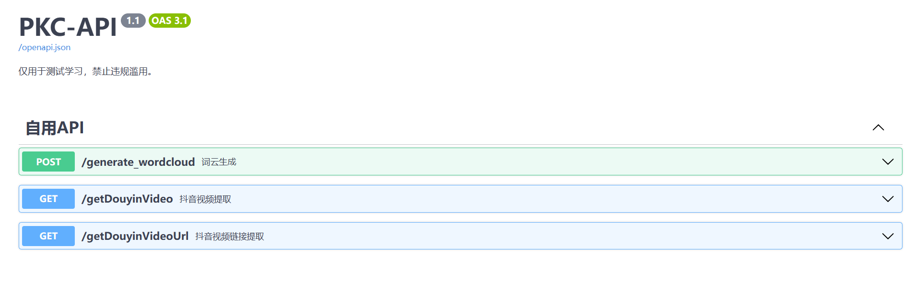

# PKC-API 
### v1.2.0
### API接口名称
***    
- *1.词云分析*
- *2.抖音视频解析*
- *3. ...*
***
## Ⅰ.搭建PKC-API
环境要求：   
CPU: 2核心或以上    
内存: 4GB或更高  
其他：国内IP
### 方式一：Docker一键部署
```bash
docker run -d --name pkc-api -p 80:80 curtinlv/pkc-api:latest
```

### 方式二：Docker-compose部署    
建立文件`docker-compose.yaml`，文件内容以下：
```yaml
version: '3'
services:
  pkc-api:
    image: curtinlv/pkc-api:latest
    container_name: pkc-api
    ports:
      - "80:80"
    environment:
      - apiKey=   #接口密钥，如未配置则每次启动随机生成一个
      - disableInterfaces=   #禁用的接口，将需要禁用的接口路径填入下面，多个用,分隔。如禁用 抖音视频解析接口，填写 /getDouyinVideo,/getDouyinVideoUrl
      - sleepNum=10  #解析等待时间，时间越多解析越慢但成功率越大
    volumes:
      - ./config.ini:/app/config.ini  #映射配置文件config.ini
 #     - ./static/pkc.ttf:/app/static/pkc.ttf #词云字体
    restart: unless-stopped
```
启动
```bash
docker-compose up -d
```
### 方式三：Python启动
版本要求：`python3.9 +` 
```bash
# 拉取本项目
git clone https://github.com/curtinlv/PKC-API.git
# 切换项目目录
cd PKC-API
# 安装依赖包
pip install -r requirements.txt 
# 词云字体（可自定义）
export FONT_PATH=./static/pkc.ttf 
# 启动
python main.py  
# 或
nohup python main.py >./log.log 2>&1 & #后台启动
````
## Ⅱ.API调试页面
```html
http://ip/swagger
```


## Ⅲ.更新日志
~~~
v1.2.0
  1、优化抖音解析接口
  2、新增外挂配置文件 config.ini（可配置自定义端口、apiKey验证、禁用指定接口）
  3、增加接口apiKey认证（默认临时生成apiKey到控制台，如需配置固定apiKey请编辑配置文件config.ini）
  
v1.1.0
  1、新增抖音解析接口

v1.0.0
  1、新增词云接口
~~~